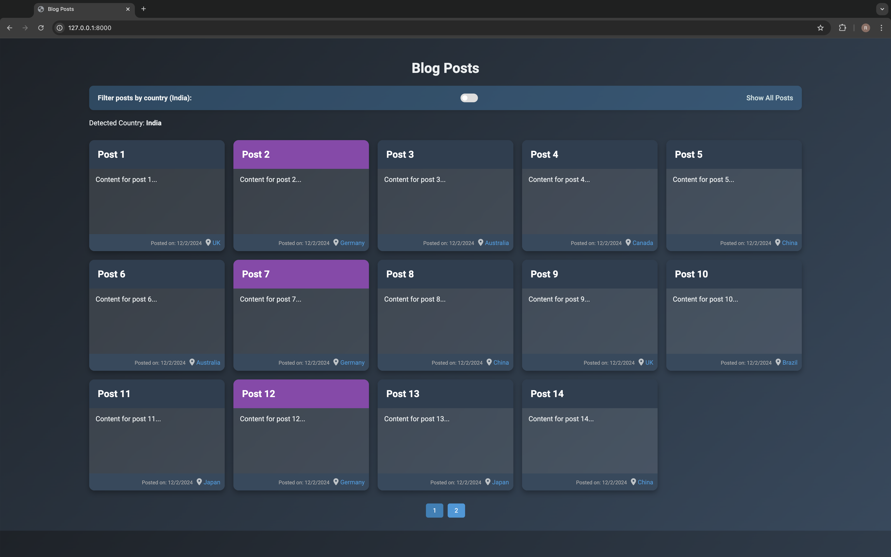

# Django Developer Task

## Objective

We are looking for an experienced Django developer who can complete the following tasks efficiently. The goal is to demonstrate your ability to work with Django, integrate APIs, write management commands, and implement frontend JavaScript functionality.

## Tasks

### 1. **Detect User's Country Based on IP Address (Backend)**
   - **Description**:  
     Create a function that detects the user's country based on their IP address. Use an external API (such as ip-api or ipify) to get the country information.
   
   - **Expected Outcome**:  
     - The country of the user is detected based on their IP.  
     - The function is integrated into a Django view and passed to the template as context.  
   
   - **Time Estimate**: 3-5 minutes

### 2. **Create a Django Management Command to Import Blog Posts from CSV (Backend)**
   - **Description**:  
     Create a management command that will read blog posts from a CSV file (available in data/blog_posts.csv) and import them into the Django database. Each blog post should have:
     - Title
     - Content
     - Country (optional field)
     
     The CSV file will have these columns:
     ```
     title, content, country
     ```

   - **Expected Outcome**:  
     - The management command successfully reads the CSV file and imports the blog posts.  
     - You should also handle basic error checks, such as ensuring required fields are present in the CSV.

   - **Time Estimate**: 5-7 minutes

### 3. **Frontend: Filter Blog Posts by Country Using JavaScript (Frontend)**
   - **Description**:  
     Implement a simple slider or toggle that allows the user to dynamically filter the blog posts displayed on the frontend based on the detected country.
   
   - **Expected Outcome**:  
     - The page should show all blog posts by default.  
     - When a country is detected, only the posts from that country should be shown.  
     - The filtering should happen dynamically without refreshing the page.

   - **Time Estimate**: 5-7 minutes

### 4. **Optional Task: Styling and Enhancements (Frontend)**
   - **Description**:  
     Make the blog page visually appealing and modern. You can use CSS frameworks like Bootstrap or Tailwind CSS, or create your own custom styles.
   
   - **Expected Outcome**:  
     - Apply a modern, clean design for the blog posts.  
     - The filter slider or toggle should have a visually appealing UI.  
     - Ensure the design is responsive and mobile-friendly.

   - **Bonus Points**:  
     - Make the design interactive, such as adding hover effects or animations to the posts or slider.  
     - Add a minimalistic card layout for blog posts with images or icons.

## Screenshots

Here are the screenshots showing how the functionalities should look:

- **Sample Data: Blog Posts Data in csv**  
   

- **Output 1: Enhanced Blog Post List View (Frontend Improvements)**  
   

- **Output 2: Blog Post with Pagination**  
   

- **Output 3: Blog Posts Page (Country-Based Filter)**  
   


## Deliverables

### Backend Tasks:
- The function to detect the user's country and integrate it into a Django view.
- A management command to import blog posts from a CSV file.

### Frontend Task:
- A dynamic slider or toggle to filter posts by country.

### Optional Task:
- Styling and enhancing the blog page to make it modern and visually appealing.

## How to Submit:

1. **Create a GitHub Repository**:  
   - Create a GitHub repository containing your code. Ensure that the repository has a README.md file explaining the setup and how to run the project. Include any necessary requirements in the `requirements.txt` file.

2. **Upload the Code**:  
   - Upload your code and commit your changes regularly. We prefer clean, readable code with comments where necessary.

3. **Demonstrate the Functionality**:  
   - Provide a brief walkthrough of your solution. You can create a short demo or include screenshots of the result.

## Evaluation Criteria:

- **Code Quality**: Clean, readable, and well-structured code.
- **Efficiency**: How well you have structured your code and your ability to solve the tasks within the estimated time.
- **Problem Solving**: Ability to handle third-party integrations, error handling, and edge cases.
- **UI/UX**: How modern and responsive your frontend design looks.
- **Bonus**: If you implement the optional task, bonus points will be given for creativity and responsiveness.

## Time Estimate for the Task:
- **Main Tasks**: 10-15 minutes.
- **Optional Task**: 5-10 minutes for styling and enhancements.

Good luck!


# Project Title
Django Developer Task


## Authors
Mahender
- [@octokatherine](https://github.com/mahender111)


## Acknowledgements

 - [Awesome Readme Templates](https://awesomeopensource.com/project/elangosundar/awesome-README-templates)
 - [Awesome README](https://github.com/matiassingers/awesome-readme)
 - [How to write a Good readme](https://bulldogjob.com/news/449-how-to-write-a-good-readme-for-your-github-project)


## Features

1. Detect User's Country Based on IP Address (Backend)
2. Create a Django Management Command to Import Blog Posts from CSV (Backend)
3. Frontend: Filter Blog Posts by Country Using JavaScript (Frontend)
4. Styling and Enhancements (Frontend)


## Documentation

[Documentation](https://linktodocumentation)


## Environment Variables

To run this project, you will need to add the following environment variables to your .env file

`API_KEY`

`ANOTHER_API_KEY`
'venv'


## 🚀 About Me
I'm a full stack developer...

https://github.com/mahender111
## 🔗 Links
[](https://github.com/mahender111
)
[](https://www.linkedin.com/in/mahendersingh059/
)
[](https://hub.docker.com/u/mahender048)

https://github.com/mahender111
https://www.linkedin.com/in/mahendersingh059/
https://hub.docker.com/u/mahender048
## API Reference

